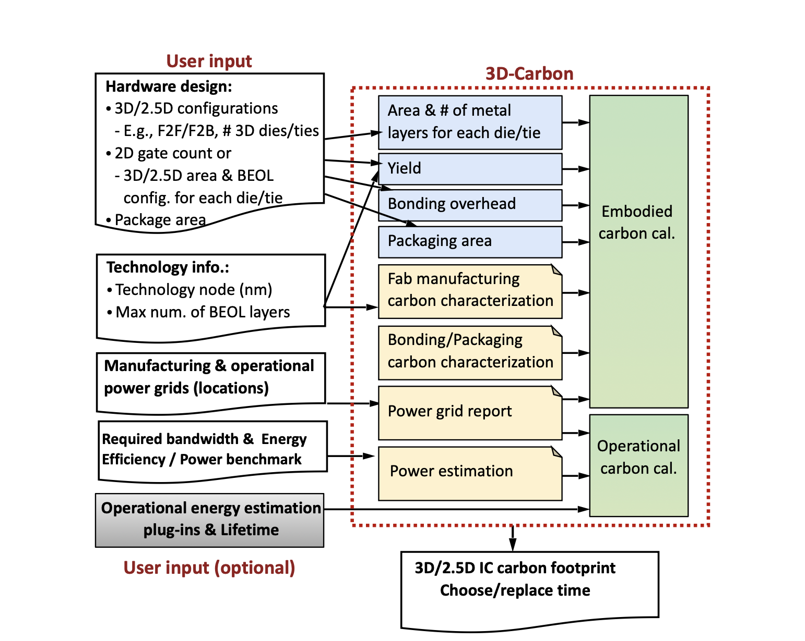
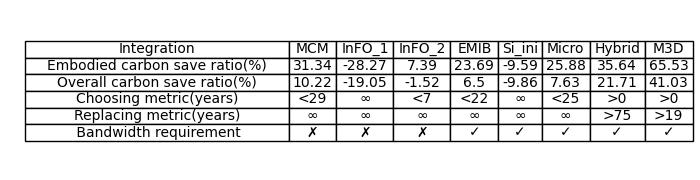
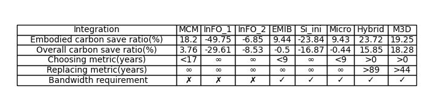
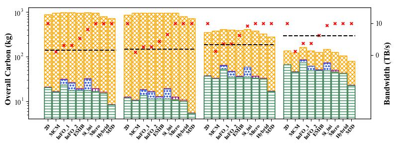
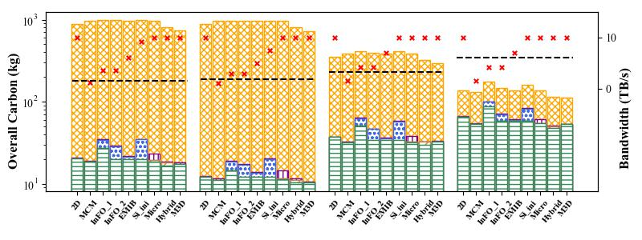

# 3D-Carbon: An Analytical Carbon Modeling Tool for 3D and 2.5D Integrated Circuits

Private release of code and data associated with DAC 2024 submission "3D-Carbon: An Analytical Carbon Modeling Tool for 3D and 2.5D Integrated Circuits" for the purpose of review.

3D-Carbon is an analytical carbon modeling tool to quantify the carbon emissions of 3D/2.5D ICs throughout their life cycle. 3D-Carbon faithfully considers a number of critical features absent in existing carbon modelings, including (1) multiple 2.5D/3D integration manufacturing processes, (2) factors like improved yield, area efficiency, use of heterogeneous technologies, and fewer metal layers could reduce the overall carbon footprint, and (3) the 2.5D/3D operational power scaling and application constraints like bandwidth. 3D-Carbon can be used to calculate the specific 2.5D/3D ICs carbon or serve as early design approximation.

The full paper is under DAC 2024 review and is available online at https://arxiv.org/abs/2307.08060.

## Abstract

Environmental sustainability is crucial for Integrated Circuits (ICs) across their lifecycle, particularly in manufacturing and use. Meanwhile, ICs using 3D/2.5D integration technologies have emerged as promising solutions to meet the growing demands for computational power. However, there is a distinct lack of carbon modeling tools for 3D/2.5D ICs. Addressing this, we propose 3D-Carbon, an analytical carbon modeling tool designed to quantify the carbon emissions of 3D/2.5D ICs throughout their life cycle. 3D-Carbon factors in both potential savings and overheads from advanced integration technologies, considering practical deployment constraints like bandwidth. We validate 3D-Carbon’s accuracy against established baselines and illustrate its utility through case studies in autonomous vehicles. We believe that 3D-Carbon lays the initial foundation for future innovations in developing environmentally sustainable 3D/2.5D ICs.

## Table of Content

- [File structure](#file-structure)
- [Prerequisities](#prerequisities)
- [How to use 3D-Carbon](#How-to-use-3D-Carbon)
  - [3D-Carbon's 3D/2.5D IC lifecycle carbon footprint modeling](#3d-carbons-3d25d-ic-lifecycle-carbon-footprint-modeling)
  - [Design exploration: homogeneous and heterogeneous](#design-exploration-homogeneous-and-heterogeneous)
- [Refrence](#Refrence)

## File structure

```
.
├── parameters
│   ├── carbon_intensity
│   │   ├── manufacturing_location
│   │   └── source
│   ├── configs
│   │   ├── bonding_yield
│   │   ├── die_yield
│   │   ├── feature_size
│   │   ├── layer_config
│   |   └── scaling_factors
|   ├── delay
│   │   ├── delay_scaling_factors
│   |   └── delay_node_factors
|   ├── power
│   │   ├── power_scaling_factors
│   |   └── power_intensity
│   ├── logic
│   │   ├── epa_BEOL_perlayer
│   │   ├── epa_BEOL
│   │   ├── epa_FEOL
│   │   ├── epa_MOL
│   │   ├── epa
│   │   ├── gpa
│   │   └── mpa
│   └── packaging
│       ├── epa_bonding
│       ├── epa_package
│       └── epa_substrate
│
├── models
│   ├── models
│   │   ├── die
│   │   ├── carbon_compute
│   │   └──  substrate
│   ├── carbon_estimate
│   ├── carbon_explore
│   └── api
│
└── example
    ├── examples_estimation
    └── examples_exploration
```

## Prerequisities

The code has the following dependencies:

> - python >= 3.6.10
> - PyYAML >= 1.1 (dependency automatically handled at installation)
> - yamlordereddictloader >= 0.4 (dependency automatically handled at installation)
> - numpy >= 1.18.5

## How to use 3D-Carbon

There are two available approaches for 3D-Carbon. The first method involves inputting the total carbon emission of a specific configuration, and it yields both the total carbon and the detailed breakdown of carbon. The second approach requires inputting the configuration of a 2D chip and exploring various methods and partitioning strategies in a fixed throughput scenario.

### 3D-Carbon's 3D/2.5D IC lifecycle carbon footprint modeling



We input specific 2.5D/3D configurations to calculate the total carbon model. According to [1], in the output, carbon is broken down into embodied carbon and operational carbon. The embodied carbon is further subdivided into die manufacturing, bonding, packaging, and interposer (2.5D only).

<!---We follow the recent studies to build the total life cycle carbon footprint ($C_{total}$), which consists of both operational ($C_{operational}^{3D/2.5D}$) and embodied ($C_{embodied}^{3D/2.5D}$) emissions.

$$C_{total}= C_{operational}^{3D/2.5D} + \gamma \cdot C_{embodied}^{3D/2.5D}$$

The operational carbon ($C_{operational}^{3D/2.5D}$) is the product of the energy ($E_{operational}^{3D/2.5D}$) consumed by the IC during USAge and the USAge-phase carbon intensity ($CI_{use}$).

$$C_{operational}^{3D/2.5D} = CI_{use} \cdot E_{operational}^{3D/2.5D}$$

The embodied carbon footprint ($C_{embodied}^{3D/2.5D}$) is an amortized embodied carbon based on the application run-time ($T_{app}$), and the overall execution time ($T_{exe}$) of the IC.

$$C_{embodied}^{3D/2.5D} = C_{embodied,overall}^{3D/2.5D} \cdot \frac{T_{app}}{T_{exe}}$$

Unlike 2D ICs, 3D/2.5D ICs integrate several ($N$ in our model) 2D dies and incur bonding carbon emissions. For silicon interposer-based 2.5D ICs, an extra silicon interposer is also manufactured. We include die manufacturing emissions for all dies ($C_{die}^{3D/2.5D}$), bonding emissions ($C_{bonding}^{3D/2.5D}$), packaging carbon ($C_{packaging}^{3D/2.5D}$), as well as a dedicated 2.5D substrate carbon ($C_{substrate}^{2.5D}$) for the unifying substrate for InFO-based and silicon interposer-based 2.5D to formulate the overall embodied carbon footprint ($C_{embodied,overall}^{3D/2.5D}$) as follows:

$$C_{embodied, overall}^{3D/2.5D} = C_{die}^{3D/2.5D} + C_{bonding}^{3D/2.5D} + C_{packaging}^{3D/2.5D} \nonumber + C_{substrate}^{2.5D}$$ !--->

#### Input files

<!-- #### print_carbon:-->

We create `.yaml` format files under examples/examples_estimation as input examples. Please note that some parameters are optional. If you do not provide these parameters, we will use the formulas from the paper to estimate them. The format of the parameters in the `.yaml` file is as follows:

- **product (_str, optional_)** - Product/IC's name (default: `''`)

- **method (_str,Range: {'MCM', 'InFO_chip_first', 'InFO_chip_last', 'Si_int', 'EMIB', 'Micro_bumping', 'Hybrid_bonding', 'Monolithic_3D'}_)** - Integration method

- **manufacturing-power-grid (_str, Range: {'world', 'India', 'Australia', 'Taiwan', 'Singapore', 'USA', 'Europe', 'Iceland'}, optional_)** - Manufacturing_location (default: `'world'`)

- **stacking (_str, {'D2W', 'W2W'}, optional, only for 3D_)** - Stacking in D2W or W2W (default: `'D2W'`)

- **F2F/F2B (_str, {'F2F', 'F2B'}, optional, only for 3D_)** - Integration in F2F or F2B (default: `'F2B'`)

  Note: We consider that When F2F is selected, once the number of dies exceeds 2, other dies will be stacked by F2B by default.

- **die_list**

  - **name (_str, optional_)** - Die's name (default: `'die'`)
  - **technode(nm) (_int, Range: {3, 5, 7, 8, 10, 12, 14, 28}_)** - Die's technology node
  - **type (_str, Range: {'logic','memory'} optional_)** - Die's name (default: `'logic'`)
  - **gnumber (_int, optional_)** - gate number (default: `0`)
  - **area(mm2) (_float, optional_)** - Die's area. Please note that one of the gnumber and area parameters must not be 0, otherwise, an error will be prompted. (default: `0`)
  - **layer (_int, optional_**) - Die's layer (default: depending on the technology node)
  - **IO-number (_int, optional_)** - Die's IO driver number (default: `0`)
  - **number (_int, optional, only for 2.5D_)** - For 2.5D integration, set this parameter to indicate the number of dies of this type. For 3D integration, as the stacking order matters, please use the default value of 1; otherwise, it will raise an error. (default: `1`)

  Note: For 3D integration, We consider the first die in this die list as the die directly connected to the package substrate, and the last die in this die list as the die which is farthest away from the package substrate
  <!--- **design-exploration (_{0,1}, optional_)** - When set to 1, the CDP, CEP, and tCDP metrics will be calculated. (default: `0`)
  !-->

- **use-power-grid (_str, Range: {'world', 'India', 'Australia', 'Taiwan', 'Singapore', 'USA', 'Europe','Iceland}, optional_)** - Use_location (default: `'world'`)

- **application_list**

  - **type (_str, Range: {"CPU(desktop)", "CPU(mobile)", "CPU(server)", "GPU(desktop)", "GPU(mobile)", "GPU(server)", "Desktop SOC", "Mobile SOC"}, optional_)** - IC's application (default: `'CPU(desktop)'`)
  - **energy(mJ) (_float, optional_)** - Energy consumption when running the application on the IC (default: `0`)
  - **power(W) (_float, optional_)** - Power when running the application on the IC (default: `0`)
  - **T-app(s) (_float, optional_)** - Application run-time on the IC (default: `0`)

#### Running

To create a YAML file for the estimation of the carbon footprint for your desired 2.5D/3D chip configuration, you can refer to the instructions in the `inputs` document and explore YAML examples under the `examples` directory.

After creating a YAML file based on your specific 2.5D/3D chip configuration, you can execute the following command in your terminal:

```bash
python src/carbon_estimate.py /path/to/your/yaml/file
```

Replace /path/to/your/yaml/file with the actual path to your YAML configuration file. Make sure you have the necessary dependencies installed before running the command. You may refer to the documentation for additional details.

#### Output

Example of AMD EPYC 7351 using 2.5D MCM integration output (examples/examples_estimation/MCM/EPYC_7351P.yaml):

```
Here is  EPYC_7351 overall embodied carbon breakdown:
zen1: 16.80 kg, package: 3.47 kg, overall embodied carbon: 20.27 kg
Here is the total life cycle carbon footprint:
Embodied carbon: 2.03e+04 g, Operational carbon: 1.98e+04 g.
```

### Design exploration: homogeneous and heterogeneous

We input 2D configurations to explore different designs. We use two-chip division approaches: homogeneous (splitting the chip into two similar chiplets in 3D/2.5D)[2] and heterogeneous. We consider eight integration methods: 2D/MCM/InFO-first/InFO-last/EMIB/Silicon interposer/Micro-bonding/Hrbird-bonding/Monolithic3D.

#### Input

Please input some configurations of the original 2D chip. We create `.yaml` format files under ../examples/ as input examples. The format of the parameters in the `.yaml` file is as follows:

- **name (_str, optional_)** - Die's name (default: `'die'`)

- **type (_str, Range: {'logic','memory'} optional_)** - Die's name (default: `'logic'`)

- **manufacturing-power-grid (_str, Range: {'world', 'India', 'Australia', 'Taiwan', 'Singapore', 'USA', 'Europe', 'Iceland'}, optional_)** - Manufacturing_location (default: `'world'`)

- **technode(nm) (_{3, 5, 7, 8, 10, 12, 14, 28}_)** - Die's technology node

- **memory-technode(nm) (_{3, 5, 7, 8, 10, 12, 14, 28}_)** -Separating memory and IOs' technology node in heterogeneous node

- **gnumber (_int, optional_)** - gate number (default: `0`)

- **area(mm2) (_int, optional_)** - Die's area. Please note that one of the gnumber and area parameters must not be 0, otherwise, an error will be prompted. (default: `0`)

- **layer (_int, optional_)** - Die's layer (default: depending on the technology node)

- **bandwidth-requirement (_float, optional_)** - lowest bandwidth requirement for applications(default: `0`)

- **IO-number (_int, optional_)** - Die's IO driver number (default: `0`)

- **memory(MB) (_int, optional_)**- Die's memory size (default: `0`)

- **use-power-grid (_str, Range: {'world', 'India', 'Australia', 'Taiwan', 'Singapore', 'USA', 'Europe','Iceland}, optional_)** - Use_location (default: `'world'`)

- **stacking (_str, {'D2W', 'W2W'}, optional, only for 3D_)** - Stacking in D2W or W2W (default: `'D2W'`)

- **F2F/F2B (_str, {'F2F', 'F2B'}, optional, only for 3D_)** - Integration in F2F or F2B (default: `'F2B'`)

  Note: We consider that When F2F is selected, once the number of dies exceeds 2, other dies will be stacked by F2B by default.

- **throughput (_int, optional_)** - application's operation throughput (default: `'CPU(desktop)'`)

- **energy-efficiency (TOPS/W) (_float, optional_)** - Energy consumption for each operation (default: `0`)

- **power(W) (_float, optional_)** - Power when running the application on the IC (default: `0`)

- **Delay (s) (_float, optional_)** - Operation delay on the IC (default: `0`)

#### Running

To create a YAML file for design exploration of the carbon footprint for your desired 2.5D/3D chip configuration, you can refer to the instructions in the `inputs` document and explore YAML examples under the `examples` directory.

After creating a YAML file based on original 2D chip configuration, you can execute the following command in your terminal:

```bash
python src/carbon_explore.py /path/to/your/yaml/file
```

Replace /path/to/your/yaml/file with the actual path to your YAML configuration file. Make sure you have the necessary dependencies installed before running the command. You may refer to the documentation for additional details.

#### Output

Example of THOR output (examples/examples_exploration/THOR.yaml):





Fig 5 in our paper is a summary result of NVIDA DRIVE series design exploration.

The homogeneous result:



The heterogeneous result:



<!-- ### Input methods -->

<!--

#### exploration:

For the exploration function, this tool can be designed to explore the carbon footprint under different variables in the early stage. We create `.yaml` format files under ../examples/Design_exploration as input files. The format of the parameters in the `.yaml` file is as follows:

- **technode(nm) (_{3, 5, 7, 8, 10, 12, 14, 28}_)** - Die's technode

- **die_number** - Die's number

- **Variables**

  - **Variable (_str,{'area','gamma'}_)** - Variable's name
  - **Model (_str,{'set','range'}_)** - Variable's input method
    if Model=='set':
  - **Variable_set (_list_)** -Variable's range.
    if Model=='range'
  - **begin(_int_)** -Variable range's begin.
  - **end(_int_)** -Variable range's end.
  - **linspace(_int_)** -Variable range's linspace.
    Note: If the input variable is one, a bar graph is automatically output, and two are heat maps
     -->

<!-- After creating `.yaml` files, you can use them as in example.ipynb. -->
<!--

More use examples can be found in our [example.ipynb](example.ipynb).

1. Create `.yaml` files

2. Introduce the method

```python
from api import print_carbon, exploration
```

3. Give the `.yaml` files to calculate the total life cycle carbon footprint. Note that they must be under the `../examples` folder

The following is an example of AMD EYPC 7452 series using 2.5D MCM integration:

```python
print_carbon('MCM/EPYC_7452.yaml')
```

The corresponding printed result:

```
Here is  EPYC_7272 overall embodied carbon breakdown:
zen2: 6.38 kg, IO1: 9.96 kg, package: 3.47 kg, overall embodied carbon: 19.81 kg

```

The following is an example of the design exploration of AVs both homogeneous and heterogeneous architectures :

```python
PX=AV('examples/AV/PX.yaml')
XAIVER=AV('examples/AV/XAIVER.yaml')
ORIN=AV('examples/AV/ORIN.yaml')
THOR=AV('examples/AV/THOR.yaml')
draw_AV([PX.data,XAIVER.data,ORIN.data,THOR.data],[PX.bandwidth,XAIVER.bandwidth,ORIN.bandwidth,THOR.bandwidth])
```

The homogeneous result:


```python
PX=AV('examples/AV/PX.yaml',option='heter',memorynode=28)
XAIVER=AV('examples/AV/XAIVER.yaml',option='heter',memorynode=28)
ORIN=AV('examples/AV/ORIN.yaml',option='heter',memorynode=28)
THOR=AV('examples/AV/THOR.yaml',option='heter',memorynode=28)
draw_AV([PX.data,XAIVER.data,ORIN.data,THOR.data],[PX.bandwidth,XAIVER.bandwidth,ORIN.bandwidth,THOR.bandwidth])
```

The heterogeneous result:


<!--
4. Give the `.yaml` files to  explore the carbon footprint under different variables in the early stage. Note that they must be under the `../examples` folder. The program will automatically output pictures according to the .yaml file

```python
exploration('Design_exploration/area.yaml')
```

The corresponding result:


```python
exploration('Design_exploration/area_gamma.yaml')
```

The corresponding result:


Here is design exploration result of THOR ==>
In homogeneous architecture:
For 2D method:  die: 66.06 kg,bonding: 0.00 kg,substrate: 0.00 kg,packaging: 0.77 kg, overall embodied carbon: 66.83 kg, operational carbon: 69.14 kg.
Bandwidth is: 1e+01 TB/s, meet the bandwidth requirement.
For MCM method:  die: 45.04 kg,bonding: 0.00 kg,substrate: 0.00 kg,packaging: 0.84 kg, overall embodied carbon: 45.88 kg, operational carbon: 76.18 kg.
Bandwidth is: 0.75 TB/s, don't meet the bandwidth requirement!!!
For InFO_1 method:  die: 73.67 kg,bonding: 0.00 kg,substrate: 11.21 kg,packaging: 0.84 kg, overall embodied carbon: 85.72 kg, operational carbon: 76.13 kg.
Bandwidth is: 2.1 TB/s, don't meet the bandwidth requirement!!!
For InFO_2 method:  die: 48.87 kg,bonding: 0.00 kg,substrate: 12.17 kg,packaging: 0.84 kg, overall embodied carbon: 61.88 kg, operational carbon: 76.13 kg.
Bandwidth is: 2.1 TB/s, don't meet the bandwidth requirement!!!
For EMIB method:  die: 48.87 kg,bonding: 0.00 kg,substrate: 0.49 kg,packaging: 0.84 kg, overall embodied carbon: 50.21 kg, operational carbon: 76.11 kg.
Bandwidth is: 3.6 TB/s, don't meet the bandwidth requirement!!!
For Si_ini method:  die: 48.87 kg,bonding: 0.00 kg,substrate: 9.08 kg,packaging: 0.84 kg, overall embodied carbon: 58.80 kg, operational carbon: 76.12 kg.
Bandwidth is: 6.5 TB/s, meet the bandwidth requirement.
For Micro method:  die: 45.69 kg,bonding: 0.38 kg,substrate: 0.00 kg,packaging: 3.46 kg, overall embodied carbon: 49.53 kg, operational carbon: 76.05 kg.
Bandwidth is: 1e+01 TB/s, meet the bandwidth requirement.
For Hybrid method:  die: 41.55 kg,bonding: 1.08 kg,substrate: 0.00 kg,packaging: 0.38 kg, overall embodied carbon: 43.01 kg, operational carbon: 63.43 kg.
Bandwidth is: 1e+01 TB/s, meet the bandwidth requirement.
In  heterogeneous architecture:
For 2D method:  die: 66.06 kg,bonding: 0.00 kg,substrate: 0.00 kg,packaging: 0.77 kg, overall embodied carbon: 66.83 kg, operational carbon: 69.14 kg.
Bandwidth is: 1e+01 TB/s, meet the bandwidth requirement.
For MCM method:  die: 53.82 kg,bonding: 0.00 kg,substrate: 0.00 kg,packaging: 0.84 kg, overall embodied carbon: 54.66 kg, operational carbon: 76.18 kg.
Bandwidth is: 0.83 TB/s, don't meet the bandwidth requirement!!!
For InFO_1 method:  die: 88.02 kg,bonding: 0.00 kg,substrate: 11.21 kg,packaging: 0.84 kg, overall embodied carbon: 100.08 kg, operational carbon: 76.13 kg.
Bandwidth is: 2.3 TB/s, don't meet the bandwidth requirement!!!
For InFO_2 method:  die: 58.40 kg,bonding: 0.00 kg,substrate: 12.17 kg,packaging: 0.84 kg, overall embodied carbon: 71.41 kg, operational carbon: 76.13 kg.
Bandwidth is: 2.3 TB/s, don't meet the bandwidth requirement!!!
For EMIB method:  die: 58.40 kg,bonding: 0.00 kg,substrate: 0.49 kg,packaging: 0.84 kg, overall embodied carbon: 59.73 kg, operational carbon: 76.11 kg.
Bandwidth is: 4.0 TB/s, don't meet the bandwidth requirement!!!
For Si_ini method:  die: 58.40 kg,bonding: 0.00 kg,substrate: 9.08 kg,packaging: 0.84 kg, overall embodied carbon: 68.32 kg, operational carbon: 76.11 kg.
Bandwidth is: 6.0 TB/s, don't meet the bandwidth requirement!!!
For Micro method:  die: 54.08 kg,bonding: 0.90 kg,substrate: 0.00 kg,packaging: 5.54 kg, overall embodied carbon: 60.52 kg, operational carbon: 76.05 kg.
Bandwidth is: 1e+01 TB/s, meet the bandwidth requirement.
For Hybrid method:  die: 47.83 kg,bonding: 2.53 kg,substrate: 0.00 kg,packaging: 0.61 kg, overall embodied carbon: 50.97 kg, operational carbon: 63.43 kg.
Bandwidth is: 1e+01 TB/s, meet the bandwidth requirement.

-->

## References

[1] Udit Gupta, Mariam Elgamal, Gage Hills, Gu-Yeon Wei, Hsien-Hsin S. Lee, David Brooks, and Carole-Jean Wu. 2022. ACT: designing sustainable computer systems with an architectural carbon modeling tool. In Proceedings of the 49th Annual International Symposium on Computer Architecture (ISCA '22). Association for Computing Machinery, New York, NY, USA, 784–799. https://doi.org/10.1145/3470496.3527408

[2] A. Arunkumar et al., "MCM-GPU: Multi-chip-module GPUs for continued performance scalability," 2017 ACM/IEEE 44th Annual International Symposium on Computer Architecture (ISCA), Toronto, ON, Canada, 2017, pp. 320-332, doi: 10.1145/3079856.3080231.

I have some research experience in Reinforcement Learning with Trajectory Preferences under the guidance of Prof. Huazheng Wang at OSU. (The work is planned to be submitted to ICML'24 and I am the first author).
